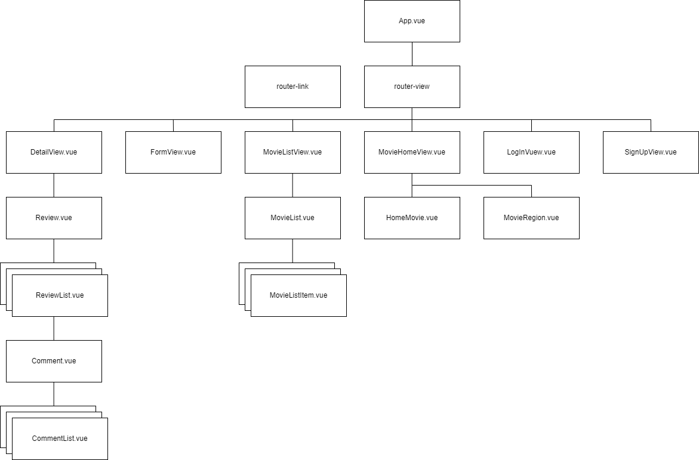
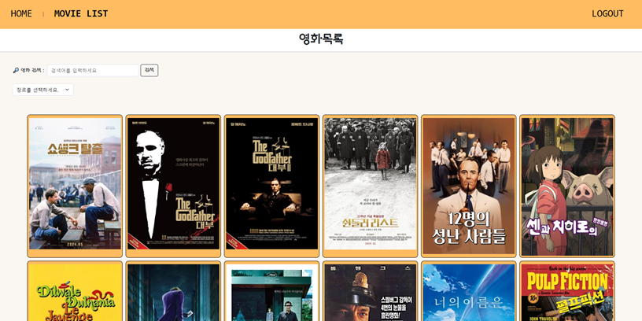
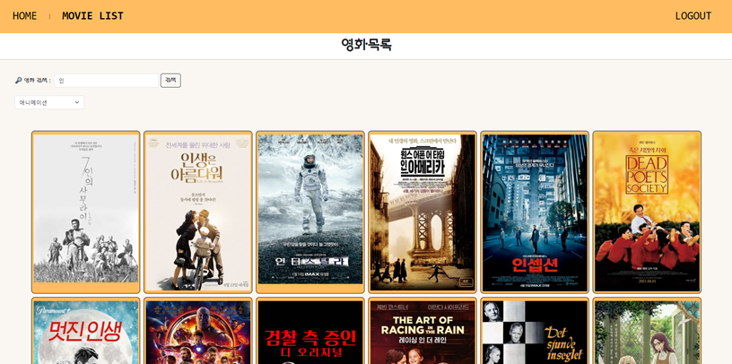
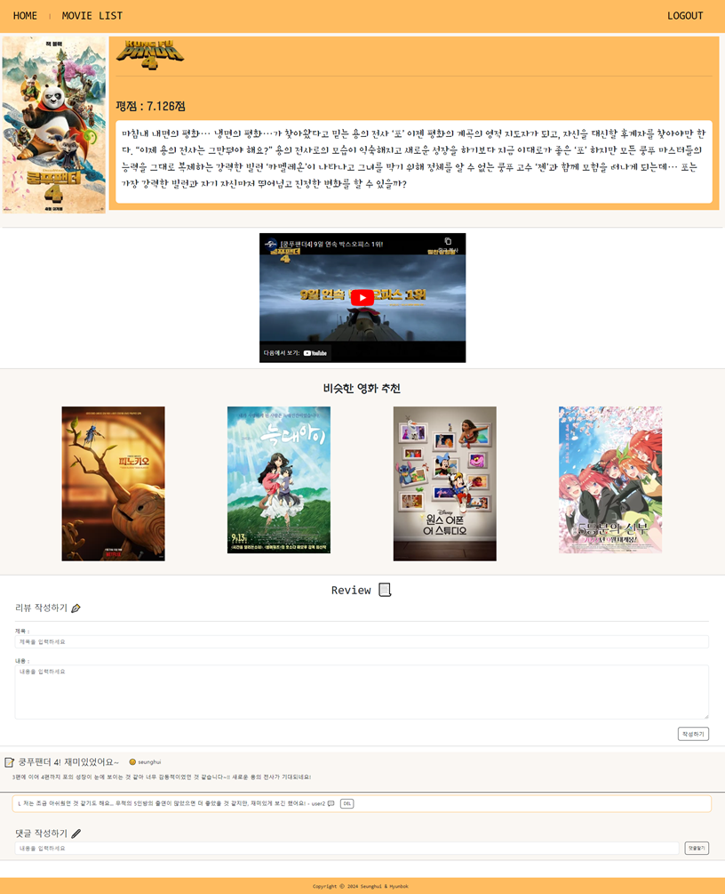

# PJT 10(Final PJT) (이현복 & 조승희 페어)

---


## 1) 팀원 정보 및 업무 분담 내역
### 공통 업무
    - 기획 및 아이디어
    - Front End (Vue)
    - API를 활용해 자료 가져오기, 가공하기
    
### 이현복
    - Front End (CSS)
    - AI를 활용하여 데이터 수집 및 활용

### 조승희 
    - READ_ME 작성
    - PPT 작성 & 발표
    - Back End (Django)
---

## 2) 목표 서비스 구현 및 실제 구현 정도

### | 목표 서비스
: `영화 검색 및 추천`을 받고 싶은 사람들을 위한 사이트
    
    - 서비스를 이용하는 유저

        1) 현재 상영하는 영화를 볼 예정인 사람
            --> 현재 어떤 영화가 상영중인지 지역별로 확인할 수 있으며, 박스오피스 순위를 통해 지금 가장 인기있는 영화는 무엇이며 평점 및 누적 관객수 등을 확인할 할 수 있다.
            (이를 통해 볼 영화를 선택할 수 있음.)
        
        2) 영화를 검색 혹은 추천받고 싶은 사람
            --> 영화 검색을 들어온 사람. 특정 장르나 키워드를 통해 영화를 검색하고, 그를 통해 찾고싶은 영화를 찾는다.
            검색한 영화의 평점, 줄거리, 트레일러 등 다양한 정보를 얻을 수 있으며 비슷한 장르의 영화의 정보도 확인할 수 있다.
            또한, 이 사이트를 이용하는 다른 사람들의 해당 영화에 대한 리뷰 및 댓글을 읽거나 직접 작성할 수도 있다.
            --> 영화를 추천받고 싶은 사람. 랜덤으로 영화를 추천받거나 혹은 특정 정보를 입력하면 그 입력 정보에 따라 좋아할만한 영화를 추천받을 수 있다.


    - 필요한 기능

        1) 회원가입 / 로그인 & 로그아웃 기능

        2) 영화 리스트 보여주기 및 검색 & 필터링 기능

        3) 현재 상영중인 영화 및 해당 영화들의 순위, 평점 등을 보여주는 기능

        4) 특정 영화의 세부 정보(이름, 별점, 줄거리 등) 및 비슷한 영화 출력 & 좋아요 기능

        5) 특정 영화에 대한 리뷰 작성/삭제 + 특정 리뷰에 대한 댓글 작성/삭제 기능

        6) 랜덤으로 영화를 골라주는 기능 및 특정 정보를 입력받은 후 그 입력 정보에 따라 영화를 추천해주는 기능

### | 실제 구현 정도


  1) ~~회원가입 / 로그인 & 로그아웃 기능~~ <- 구현
  
  2) ~~영화 리스트 보여주기 및 검색 & 필터링 기능~~ <- 구현

  3) ~~현재 상영중인 영화 및 해당 영화들의 순위, 평점 등을 보여주는 기능~~ <- 구현

  4) ~~특정 영화의 세부 정보(이름, 별점, 줄거리 등) 및 비슷한 영화 출력 기능~~ <- 구현 / 좋아요 기능 구현 못함

  5) ~~특정 영화에 대한 리뷰 작성/삭제 + 특정 리뷰에 대한 댓글 작성/삭제 기능~~ <- 구현

  6) ~~랜덤으로 영화를 골라주는 기능 및 특정 정보를 입력받은 후 그 입력 정보에 따라 영화를 추천해주는 기능~~ <- 구현

        


---

## 3) 데이터베이스 모델링 (ERD)
#### Django Model ERD


#### Vue Component ERD



---

## 4) 영화 추천 알고리즘에 대한 기술적 설명

#### 1) 랜덤으로 영화를 추천
- 랜덤으로 영화를 추천받기 기능을 실행하면 가지고 있는 영화 데이터베이스(DB)에 저장되어 있는 영화 목록의 개수 내에서의 랜덤한 숫자 5개를 받아서 영화를 출력해준다. 이때, 랜덤한 5개의 숫자 중 겹치는 숫자가 존재할 때 그 숫자는 제외한 후 영화 목록을 출력한다.


#### 2) 사용자에게 특정 정보를 입력받은 후 입력 정보에 따라 영화를 추천
- 사용자에게 특정 정보(성별, 나이대, 좋아하는 분위기)를 입력 받는다. 입력받은 정보를 조합해 Chat gpt에게 가지고 있는 영화 데이터베이스(DB)의 영화 장르들 중 사용자가 선호할만한 장르 2개를 추천받는다. 추천받은 장르를 통해 영화를 추출하고, 거기서 랜덤하게 5개의 영화를 출력해준다. (이때, 추천한 장르에 포함되는 영화가 5개 이하일 경우에는 전부 출력해준다.)


---

## 5) 핵심 기능에 대한 설명

#### 1. 회원가입 / 로그인 & 로그아웃 기능
- `axios` 를 통해 Front(Vue)에서 Back(Django)에게 통신을 요청하고 계정을 생성하고, 로그인 및 로그아웃을 할 수 있도록 한다.


```js
  const signUp = function (payload) {
    // 1) 사용자 입력 데이터를 받아
    const { username, password1, password2 } = payload
    // 2) axios로 django에 요청을 보냄
    axios({
      method:'post',
      url :  `${API_URL}/accounts/signup/`,
      data : {
        username,
        password1,
        password2
      }
    })
      .then((response) => {
        console.log('회원가입 성공!')
        const password = password1
        logIn({username, password})
      })
      .catch((error) => {
        console.log(error)
        window.alert('회원가입에 실패하였습니다. 다시 입력해주세요.')
      })

  }
```


#### 2. 영화 리스트 보여주기 및 검색 & 필터링 기능
- 1 영화 리스트 가져오기 
    - Django에 저장되어 있는 영화 데이터(DB)를 `axios` 를 통해 Vue로 가져와 리스트로 저장한다.

```js
  const movies = ref([])

  const getMovies = function () {
    axios({
      method: 'get',
      url: `${API_URL}/api/v1/movies/`,
      headers : {
        Authorization : `Token ${token.value}`
      }
    })
      .then(response => {
        movies.value = response.data
      })
      .catch(error => {
        console.log(error)
      })
  }
```



- 2 영화 장르별 필터링
    - `form / select-option` 을 이용해 원하는 장르를 선택하게 한다. 선택된 장르를 id로 변환시켜 저장한 후 리스트로 저장된 영화들의 장르 id 값을 비교해 선택된 장르 id와 일치하는 것만을 새로운 리스트에 저장해 보여준다. (filter 사용)

```html
    <form>
      <select @change="selectGenre($event)">
        <option value="0">장르를 선택하세요.</option>
        <option :value="key" v-for=" (item, key) in genres">{{ key }}</option>
      </select>
    </form>
```

```js
const selectGenre = function(event) {
  const gen = event.target.value
  if (gen !== 0) {
    num.value = genres.value[gen]
  } else {
    num.value = 0
  }
  console.log(num.value)

  if (!num.value || num.value == 0) {
    movieList.value = store.movies
  } else {
    movieList.value = store.movies
    movieList.value = movieList.value.filter((movie) => {
      return num.value == movie.genre_ids
    })
  }
}
```


- 3 영화 키워드 검색
    - `form / input` 을 이용해 사용자가 검색을 원하는 키워드를 입력하게 한다. 입력한 키워드를 받아 리스트에 저장된 영화의 제목과 비교해서 해당 키워드가 들어간 영화를 새로운 리스트에 저장해 보여준다. (filter 사용) 만약, 키워드가 들어간 영화를 찾을 수 없다면 검색 결과가 없다고 창을 띄운다.

```html
    <form @submit.prevent="MovieSearch(searchName)">
      <label for="search">영화 검색 : </label>
      <input id="search" type="text" v-model="searchName">
      &nbsp;
      <input type="submit" value="검색">
    </form>
```

```js
const MovieSearch = function (name) {
  if (!name) {
    movieList.value = store.movies
  } else {
    const tempName = name.split(' ').join('')
    movieList.value = movieList.value.filter((movie) => {
      const movieTitle = movie.title.split(' ').join('')
      return movieTitle.includes(tempName)
    })
    console.log('뽑은 무비 리스트')
    console.log(movieList.value)
    console.log(movieList.value.length)
    if (movieList.value.length === 0) {
      window.alert('검색 결과가 없습니다.')
      movieList.value = store.movies
    }

  }
  searchName.value = ''
}
```


#### 3. 현재 상영중인 영화 및 해당 영화들의 순위, 평점 등을 보여주는 기능
- `axios` 를 통해 영화진흥위원회 Open api - 일별 박스오피스를 받아와 저장해준다. 얻어온 현재 상영중인 영화 5개에서 `제목`, `순위`, `개봉일`, `누적 관객수`, `전날 관객수` 정보를 출력해준다. 원하는 지역을 선택할 경우, 해당 지역에서 상영중인 영화를 가져온다.

```js
  const boxOffice = ref([])
  const latestMovie = function () {
    axios({
      method:'get',
      url:'http://www.kobis.or.kr/kobisopenapi/webservice/rest/boxoffice/searchDailyBoxOfficeList.json',
      params : {
        key : movieAPI,
        targetDt : date,
        itemPerPage : '5'
      }
    })
      .then((response) => {
        console.log(response.data)
        boxOffice.value = response.data
      })
      .catch((error) => {
        console.log(error)
      })
  }
```

- 기본적으로 나오는 화면(전국 기준)


- 특정 지역 혹은 시를 선택하였을 때 나오는 화면


#### 4. 특정 영화의 세부 정보 및 비슷한 영화 출력 기능
- 1 특정 영화의 세부 정보 가져오기
    - 2번 기능 혹은 3번 기능을 통해 넘어온 영화 세부 페이지. 클릭한 영화에 대한 세부 정보를 `axios` 를 통해 TMDB에서 받아온 후 저장한다. 저장한 정보 중 필요한 정보들을 가져와 화면에 보여준다.

```js
// 해당 영화의 디테일의 정보를 받을 비동기 요청
const MovieDetail = {
  method: 'GET',
  url: `https://api.themoviedb.org/3/movie/${movieId.value}`,
  params: {language: 'ko-KOR'},
  headers: {
    accept: 'application/json',
    Authorization: `Bearer ${store.tmdbLongAPI}`
  }
};

axios
  .request(MovieDetail)
  .then(function (response) {
    movie.value = response.data

  })
  .catch(function (error) {
    console.error(error);
    
  });
```
- 2 특정 영화와 비슷한 영화 보여주기
    - 특정 영화의 장르 id와 같은 장르 id를 가지고 있는 영화를 `filter` 를 통해 새로운 리스트로 받아준 후, 해당 리스트에서 랜덤으로 5개를 뽑아 보여준다. (5개 이하라면 전부 보여준다.) 만약 랜덤으로 나온 5개의 영화 중 기준이 된 영화가 존재한다면 제외하고 보여준다.

```js
  targetMovie.value = store.movies.find((movie) => {
    return movie.id == moviePk
  })
  similarMovie.value = store.movies.filter((mv) => {
    return mv.genre_ids == targetMovie.value.genre_ids
  })

  if (similarMovie.value.length < 6) {
    fiveMovie.value = similarMovie.value
    
    const index = fiveMovie.value.findIndex((mv) => {
      return mv.id == moviePk
    })
    fiveMovie.value.splice(index,1)
  } else {
    generateRandomNumber(similarMovie.value.length)
    for (let i=0; i<5; i++) {
      fiveMovie.value[i] = similarMovie.value[rand_array.value[i]]
    }

    const index = fiveMovie.value.findIndex((mv) => {
      return mv.id == moviePk
    })
    fiveMovie.value.splice(index,1)
  }
```



#### 5. 리뷰 작성/삭제 + 댓글 작성/삭제 기능
- 1 리뷰 조회 및 작성 & 삭제
    - 영화 세부 페이지에서 해당 영화에 달린 리뷰를 조회하고, 작성 및 삭제를 할 수 있는 기능이다. 영화 모델과 1:N 관계를 가지고 있는 리뷰 모델에서 해당 영화의 id와 일치하는 리뷰들만 조회해서 보여준다.
    - 리뷰 작성 시 `해당 영화의 id`로 `foreign key` 가 저장되고, `로그인한 유저의 id`로 `foreign key` 가 저장된다.
    - 삭제는 작성한 유저만 가능하도록 하였고, 삭제 시 바로 사라지게 된다.

- --> 리뷰 작성 시 실행되는 함수
```js
const createReview = function (movieId) {
    axios({
      method: 'post',
      url: `${store.API_URL}/api/v1/reviews/`,
      data : {
        title : title.value,
        content : content.value,
        movie : movieId
      },
      headers : {
        Authorization : `Token ${store.token}`
      },
      
    })
      .then(response => {
        title.value = ''
        content.value = ''
        console.log('보내기 성공!')
        store.getReviews()
      })
      .catch(error => {
        console.log(error)
      })

  }
```

- --> 리뷰 삭제 시 호출되는 함수
```js
const deleteReview = function (reviewPk) {
    axios({
      method: 'delete',
      url: `${store.API_URL}/api/v1/reviews/${reviewPk}/`,
      headers : {
        Authorization : `Token ${store.token}`
      },
      
    })
      .then(response => {
        console.log('삭제성공!')
        store.getReviews()
      })
      .catch(error => {
        console.log(error)
      })

  }
```

- 2 댓글 조회 및 작성 & 삭제
    - 댓글 조회 및 작성 & 삭제 같은 경우는 리뷰의 방식과 동일하게 작용한다. 하지만 foreign key 가 유저와 리뷰로 되어있다.

- --> 댓글 작성 시 실행되는 함수
```js
const createComment = function (reviewId) {
    axios({
      method: 'post',
      url: `${store.API_URL}/api/v1/comments/`,
      data : {
        content : content.value,
        review : reviewId
      },
      headers : {
        Authorization : `Token ${store.token}`
      },
      
    })
      .then(response => {
        content.value = ''
        console.log('보내기 성공!')
        store.getComments()
      })
      .catch(error => {
        console.log(error)
      })

  }
```

- --> 댓글 삭제 시 실행되는 함수
```js
const deleteComment = function (commentPk) {
    axios({
      method: 'delete',
      url: `${store.API_URL}/api/v1/comments/${commentPk}/`,
      headers : {
        Authorization : `Token ${store.token}`
      },
      
    })
      .then(response => {
        console.log('삭제성공!')
        store.getComments()
      })
      .catch(error => {
        console.log(error)
      })

  }
```

#### 6. 영화를 추천해주는 기능
- 1 랜덤으로 영화 추천해주기
    - 말 그대로 랜덤으로 영화를 추천해주는 방식이다. 유저가 랜덤 추천을 선택했을 시, 저장해 놓은 영화 데이터(DB) 의 개수만큼의 숫자 중 무작위로 5개를 뽑아 해당 번호의 영화를 보여주게 된다.

```js
const movieBox = ref('')
const randomNumber = ref(0)
const rand_array = ref([204,210,34,243,100])

const generateRandomNumber = () => {
  randomNumber.value = Math.floor(Math.random() * 257) + 1
  rand_array.value[0]=randomNumber.value
  randomNumber.value = Math.floor(Math.random() * 257) + 1
  rand_array.value[1]=randomNumber.value
  randomNumber.value = Math.floor(Math.random() * 257) + 1
  rand_array.value[2]=randomNumber.value
  randomNumber.value = Math.floor(Math.random() * 257) + 1
  rand_array.value[3]=randomNumber.value
  randomNumber.value = Math.floor(Math.random() * 257) + 1
  rand_array.value[4]=randomNumber.value

  movieBox.value = store.movies.filter((movie)=>{
        return ((movie.id==rand_array.value[0]) ||  (movie.id==rand_array.value[1])||(movie.id==rand_array.value[2])||(movie.id==rand_array.value[3])||(movie.id==rand_array.value[4]))})
  }
```

- 2 사용자에게 받은 정보를 바탕으로 영화 추천해주기
  - 사용자에게 성별, 연령대, 좋아하는 분위기를 선택하게 한 후 얻은 정보를 바탕으로 Chat gpt 를 이용해 우리가 가지고 있는 장르 중 사용자가 좋아할만한 장르 2개를 받아낸다. 받은 장르를 기준으로 영화를 분류한 후, 출력해준다.

- --> 사용자에게 정보 받기

```html
<form @submit.prevent="formInfo()" style="border: solid black 1px;width: 620px;padding: 20px; text-align: center;background-color: rgb(250, 247, 243);">
    <p>
        <h3>당신의 성별은 무엇입니까?</h3>
        <input type="radio" name="gender" value="여성" v-model="gender"> 여성 &nbsp;&nbsp;
        <input type="radio" name="gender" value="남성" v-model="gender"> 남성 &nbsp;&nbsp;
    </p>
    <p>
        <h3>당신의 나이대는 무엇입니까?</h3>
        <input type="radio" name="age" value="10대" v-model="age"> 10대 &nbsp;&nbsp;
        <input type="radio" name="age" value="20대" v-model="age"> 20대 &nbsp;&nbsp;
        <input type="radio" name="age" value="30대" v-model="age"> 30대 &nbsp;&nbsp;
        <br>
        <input type="radio" name="age" value="40대" v-model="age"> 40대 &nbsp;&nbsp;
        <input type="radio" name="age" value="50대" v-model="age"> 50대 &nbsp;&nbsp;
        <input type="radio" name="age" value="60대 이상" v-model="age"> 60대 이상  
    </p>
    <p>
        <h3>좋아하는 분위기는 무엇입니까?</h3>
          <input type="radio" name="mood" value="즐거운 분위기" v-model="mood"> 즐거운 분위기 &nbsp;&nbsp;
          <input type="radio" name="mood" value="몽환적인 분위기" v-model="mood"> 몽환적인 분위기 &nbsp;&nbsp;<br><br>
          <input type="radio" name="mood" value="어두운 분위기" v-model="mood"> 어두운 분위기 &nbsp;&nbsp;
          <input type="radio" name="mood" value="가족같은 분위기" v-model="mood"> 가족같은 분위기 &nbsp;&nbsp;<br><br>
          <input type="radio" name="mood" value="활기찬 분위기" v-model="mood"> 활기찬 분위기 &nbsp;&nbsp;
          <input type="radio" name="mood" value="여유로운 분위기" v-model="mood"> 여유로운 분위기 &nbsp;&nbsp;
    </p>
    <button type="submit" class="btn btn-outline-dark" @click="search">제출하기</button>
</form>
```
- --> OpenAI Chat gpt 활용해 사용자가 선호할만한 장르 찾기
```js
const formInfo = function() {
    console.log(gender.value, age.value, mood.value)
    prompt.value = `아래 영화 키워드 중 [액션, 모험, 애니메이션, 코미디, 범죄, 다큐멘터리, 드라마, 가족, 판타지, 역사, 공포, 음악, 미스터리, 로맨스, SF, TV 영화, 스릴러, 전쟁, 서부] ${mood.value}를 선호하는 ${age.value} ${gender.value}이 좋아할만한 키워드 2개만 선택해 줘`
}

import OpenAI from 'openai'
const response = ref(null)

const getGPTResponse = async () => {
  try {
    const openai = new OpenAI({
      apiKey: `${import.meta.env.VITE_OPENAI_API_KEY}`,
      dangerouslyAllowBrowser: true,
    })
    const response1 = await openai.chat.completions.create({
      messages: [
        {
          role: 'user',
          content: prompt.value,
        },
      ],
      model: 'gpt-3.5-turbo',
    })
    console.log(prompt)
    console.log('chatGPT 결과: ', response1.choices[0].message.content)
    response.value = response1.choices[0].message.content.trim()
    console.log(response.value)

    let i = 0
    for (const genre of genre_names.value){
        console.log(genre)
        if (i===2){
            console.log(two_genres.value)
            break
        }
        if (response.value.includes(genre)){
            two_genres.value[i++]=genres.value[genre]
        }
    }


    
    movieBox.value = store.movies.filter((movie)=>{
        return ((movie.genre_ids==two_genres.value[1]) ||  (movie.genre_ids==two_genres.value[0]))
    })
    if (movieBox.value.length <= 5){
        check.value = 1
        // new_movieBox = movieBox
    }else{
        check.value = 1
        generateRandomNumber(movieBox.value.length)
        for(let iii=0; iii<5;iii++){
            console.log(movieBox.value[rand_array.value[iii]])
            new_movieBox.value[iii]=movieBox.value[rand_array.value[iii]]
        }
        console.log(new_movieBox.value)
    }

    console.log(movieBox.value.length)
    console.log(movieBox.value)

    
  } catch (error) {
    console.log('chatGPT: 에러가 발생했습니다.')
    console.log(error)
  }
}
```


---

## 6) 후기
#### 1) 솔직하게 말해보자면...
- 현복 : css 부터 가장 최근에 배운 vue3까지 모두를 골고루 다루어 보면서 한학기를 마무리 한다는 느낌을 받을 수 있었다. 매주 금요일 마다 진행하던 관통 프로젝트가 아닌 일주일 이상을 진행하는 최종 프로젝트이다보니 여럿이서 협업을 하며 좋은 경험을 할 수 있었고 올해 상반기를 잘 보냈다고 생각이 든다.

- 승희 : 마지막 관통 프로젝트라 그런지 구현해야 할 것도 많고 또 우리가 어떤걸 구현해야 하는지, 어느 기능을 넣을 것인지 등등을 정해야 했기 때문에 더 복잡하고 어려웠던 것 같다. 하지만 페어와 함께 상의하고 정하는 과정이 있었기 때문에 어려웠지만 차근차근 해볼 수 있었다. 1학기의 관통 프로젝트는 2학기 맛보기(?) 라는 말도 있는데, 어떤 매커니즘으로 진행이 되고, 이런 방식으로 하면 좋겠다! 등을 고민해 볼 수 있어서 좋은 기회였다고 생각한다. 아무래도 가장 어려웠던 부분은 역할 분담이었는데, 각자 본인이 잘 하는 부분이 무엇인지 확신을 하지 못했어서 그걸 정하는게 조금 오래걸렸던 것 같다. (초반에는 같이 둘이서 보면서 하는 경우가 더 많았음)


#### 2) 무사히 끝낸 기분은?
- 현복 : 하루를 제가 빠지는 와중에 승희가 잘 해줘서 성공적으로 잘 마무리 할 수 있어서 승희한테 정말  고맙다. 1학기 마무리하는 프로젝트였어서 배운 내용들을 전부 다루어 볼 수 있었던 좋은 경험이라고 생각한다.

- 승희 : 우리가 구현하려고 했던 것들이 하나씩 구현되고, 화면에 나타나고 상호작용을 하는 부분이 신기하고 또 뿌듯했던 것 같습니다!! 아직 부족한 부분이 많이 있겠지만, 지금으로서는 만족!^>^